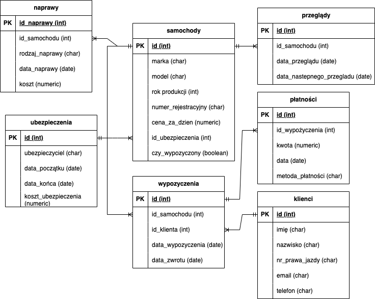

# Car Rental Management System

A full-stack application with a PostgreSQL database and a Node.js backend that enables comprehensive management of a car rental business. It includes client management, car fleet tracking, rentals, payments, insurance, maintenance, and inspections.

## 🗃️ Database Overview

### Main Tables:

- **Clients**: Stores customer data including name, license number, and contact info.
- **Cars**: Information about each car (brand, model, year, rental price, insurance).
- **Rentals**: Tracks active and completed rentals with client and car IDs.
- **Payments**: Payment records with amounts, methods, and dates.
- **Repairs**: History of vehicle repairs and costs.
- **Inspections**: Technical check-ups with future inspection dates.
- **Insurance**: Policies with coverage dates and costs.

### Relations:

- One client → Many rentals  
- One car → Many rentals, repairs, inspections  
- One rental → Many payments  
- One insurance policy → One car

## Key Features

- **Client Operations**: Add, edit, delete, and retrieve clients.
- **Car Management**: Track availability, status, repairs, and inspection schedules.
- **Rental Workflow**: Automatic status updates on rent/return.
- **Insurance Verification**: Ensures cars cannot be rented without valid insurance.
- **Automated Triggers & Procedures**: For rentals, payments, data consistency.
- **Statistics**: Rental frequency, average cost, income summaries, etc.

## PostgreSQL Functions & Procedures

- `dodajklienta`, `edytujklienta`, `usunklienta` – Manage clients
- `liczba_wypozyczen`, `suma_przychodow(start, end)` – Reports and stats
- `oblicz_kwote_platnosci` – Auto payment calculation
- Triggers: 
  - `trigger_aktualizuj_czy_wypozyczony` (car availability)
  - `trigger_sprawdz_ubezpieczenie` (insurance validation)
  - `trg_sprawdz_przeglad` (inspection check)

## ERD Diagram

  

## Getting Started

### 1. Requirements

- [Node.js](https://nodejs.org/) (v14.x or higher)
- [PostgreSQL](https://www.postgresql.org/)
- npm (comes with Node.js) or yarn

### 2. Setup

1. Clone the repository:
```bash
git clone https://your-repo-url.git
cd your-project-folder

2. Install dependencies:
```bash
npm install
```

3. Import the PostgreSQL database schema using your preferred client (e.g., pgAdmin or psql CLI).


4. Update the db.js file with your PostgreSQL connection settings:

```bash
const { Pool } = require('pg');

const pool = new Pool({
  user: 'your_db_user',
  host: 'localhost',
  database: 'your_db_name',
  password: 'your_password',
  port: 5432,
});

module.exports = pool;
```

5. Run the App
```bash
node app.js
```
Open your browser and navigate to:
http://localhost:3000 (or whichever port is set in the app)


